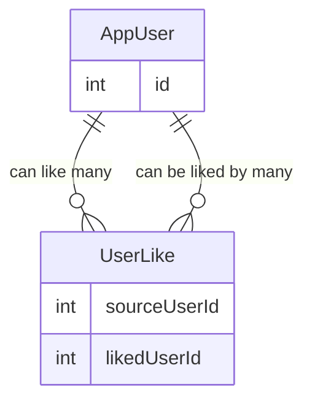

# DatingAppV2

Version 2 of Dating App

## Relational Model for Like Feature

- **AppUser** has a **many-to-many relationship with itself** (AppUser ↔ AppUser)  
- This relationship is implemented through the **UserLike** join table.
- Self referencing many to many relationship

### UserLike

- **SourceUserId** (FK → AppUser) — the user who initiates the like
- **LikedUserId** (FK → AppUser)— the user who is being liked

Each record in `UserLike` represents one user liking another user.

