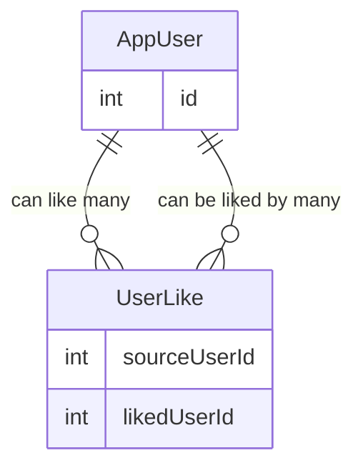

# DatingAppV2

Version 2 of Dating App

## Likes Endpoint

Base Route: /api/likes

This controller manages member-to-member likes, supporting toggling likes, retrieving liked member IDs, and listing likes based on relationship direction.

---

## 🔁 Toggle Like

### POST `/api/likes/{targetMemberId}`

Toggle a like between the current authenticated member and a target member.

### Behavior

- If the current member has not liked the target → a like is created
- If the like already exists → the like is removed
- Members cannot like themselves

### Route Parameters

| Name | Type | Description |
|------|------|------------|
| targetMemberId | string | ID of the member to like or unlike |

### Responses

| Status | Description |
|--------|------------|
| 200 OK | Like added or removed successfully |
| 400 Bad Request | Attempt to like self or persistence failure |

---

## 📌 Get Current Member’s Like IDs

### GET `/api/likes/list`

Returns a list of member IDs that the current member has liked.

### Response Example

```json
[
  "memberId1",
  "memberId2",
  "memberId3"
]
```

## 👥 Get Member Likes (Predicate-Based)

### GET `/api/likes?predicate={predicate}`

Returns a list of `Member` objects based on the type of like relationship relative to the **current authenticated user**.

---

### Query Parameters

| Name | Type | Required | Description |
|------|------|----------|------------|
| predicate | string | Yes | Determines which like relationship to return |

---

### Predicate Values & Behavior

#### `liked`

Returns members that the **current user has liked**.

**Logic**

- `SourceMemberId == currentUserId`
- Returns `TargetMember`

---

#### `likedBy`

Returns members who have **liked the current user**.

**Logic**

- `TargetMemberId == currentUserId`
- Returns `SourceMember`

---

#### `mutual` (default)

Returns members who:

- The current user has liked **AND**
- Have also liked the current user

**Logic**

1. Fetch IDs of members the current user has liked
2. Find likes where:
   - `TargetMemberId == currentUserId`
   - `SourceMemberId` exists in the liked IDs list
3. Return `SourceMember`

---

### Response Example

```json
[
  {
    "id": "memberId",
    "displayName": "Jane Doe",
    "photoUrl": "...",
    "age": 29
  }
]
```

## Relational Model for Like Feature

- **AppUser** has a **many-to-many relationship with itself** (AppUser ↔ AppUser)  
- This relationship is implemented through the **UserLike** join table.
- Self referencing many to many relationship

### UserLike

- **SourceUserId** (FK → AppUser) — the user who initiates the like
- **LikedUserId** (FK → AppUser)— the user who is being liked

Each record in `UserLike` represents one user liking another user.


