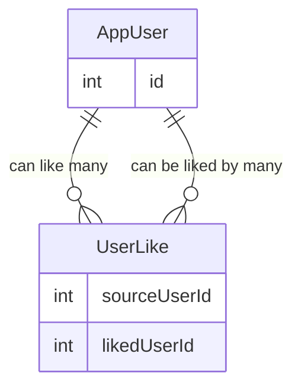

# DatingAppV2: Technical Documentation

A full-stack dating application featuring real-time communication, cloud-native photo storage, and a serverless backend architecture.

## Table of Contents

* [System Architecture](#system-architecture)
  * [Frontend](#frontend)
  * [Backend (API & Real-time)](#backend-api--real-time)
  * [Data & Storage](#data--storage)
* [Authentication and Authorization](#authentication-and-authorization)
  * [Architectural Overview](#architectural-overview)
  * [The Authentication Flow (PKCE)](#the-authentication-flow-pkce)
  * [Initializing the Challenge](#initializing-the-challenge)
  * [The Handshake](#the-handshake)
  * [Identity Verification](#identity-verification)
  * [Token Exchange and Persistence](#token-exchange-and-persistence)
  * [Securing the Gateway & WebSockets](#securing-the-gateway--websockets)
* [API Endpoints](#api-endpoints)
  * [Authentication & Identity](#authentication--identity)
  * [User Management](#user-management)
  * [Photo Service](#photo-service)
  * [Interactions & Messaging](#interactions--messaging)
* [Database Structure](#database-structure)
  * [Relational Model for Like Feature](#relational-model-for-like-feature)
* [Photo Upload & Delivery Architecture](#photo-upload--delivery-architecture)
  * [Core Infrastructure](#core-infrastructure)
  * ["Direct-to-S3" Upload Flow](#direct-to-s3-upload-flow)
  * [Image Delivery & Caching](#image-delivery--caching)
  * [Security Posture](#security-posture)
* [Real-Time Messaging Architecture](#real-time-messaging-architecture)
  * [Node.js + AWS API Gateway + DynamoDB](#nodejs--aws-api-gateway--dynamodb)
  * [Real-Time Infrastructure](#real-time-infrastructure)
  * [The Connection Lifecycle](#the-connection-lifecycle)
  * [Connection Schema (DynamoDB)](#connection-schema-dynamodb)
  * [Security & Validation](#security--validation)
  * [Key Advantages](#key-advantages-of-this-nodejslambda-approach)

---

## System Architecture

The application is built using a modern, decoupled architecture designed for scalability and high availability on AWS.

### Frontend

* **Framework:** Angular
* **Hosting:** Hosted on **Amazon S3** and distributed via **Amazon CloudFront** for low-latency global delivery and SSL termination.
* **State Management:** Utilizes Angular Signals for reactive and efficient UI updates.

### Backend (API & Real-time)

* **Primary API:** Developed in **.NET Core** and deployed as an **AWS Lambda** function. This serverless approach ensures the backend scales automatically with traffic.
* **Real-time Layer:** A **Node.js WebSocket** server handles live connections, allowing users to receive instant notifications and messages without refreshing the app.

### Data & Storage

* **Relational Database:** **Amazon RDS (PostgreSQL/SQL Server)** stores user profiles, matches, and application data.
* **Photo Service:** User-uploaded images are stored in **Amazon S3**. These assets are served through **CloudFront** to ensure fast loading times for profile browsing.

---

## Authentication and Authorization

This document outlines the end-to-end security architecture of the application, detailing how **AWS Cognito**, **Angular**, **.NET Core**, and **API Gateway** collaborate to secure RESTful communication and real-time WebSocket streams.

### Architectural Overview

The system utilizes a **Decentralized Identity Model** where the application never handles raw credentials.

* **Identity Provider (IdP):** AWS Cognito serves as the single source of truth.
* **Authentication Protocol:** OAuth 2.0 / OpenID Connect (OIDC) with **Authorization Code Flow + PKCE**.
* **Tokens:** * **ID Token:** Used for user profile data and initial WebSocket authentication.
* **Access Token:** Used for authorizing .NET REST API requests.
* **Identity Mapping:** The `sub` (subject) claim in the JWT is used as the unique identifier across the RDS database and S3 storage.

### The Authentication Flow (PKCE)

To secure the mobile and single-page application (SPA) environments, we implement **Proof Key for Code Exchange (PKCE)** to prevent authorization code injection attacks.

### Initializing the Challenge

Before redirecting the user, the Angular application locally generates:

* **Code Verifier:** A high-entropy cryptographic random string (the "Secret").
* **Code Challenge:** A Base64-URL encoded SHA256 hash of the Verifier (the "Public" version).

### The Handshake

The browser is redirected to the **Cognito Hosted UI** via the following payload:

| **Parameter** | **Purpose** |
| --- | --- |
| `client_id` | Identifies the Angular App in Cognito. |
| `redirect_uri` | Where Cognito sends the user after login. |
| `response_type` | Set to `code`. |
| `code_challenge` | The hashed verifier. |
| `state` | A random string to prevent Cross-Site Request Forgery (CSRF). |
| `scope` | Usually `openid email profile`. |

### Identity Verification

The user authenticates through the Cognito Hosted UI (via standard credentials or **Google Federation**). Upon success, Cognito redirects the user back to the Angular `redirect_uri` with:

* **Authorization Code:** A short-lived code that is useless without the Verifier.
* **State:** To be compared against the original state in Angular.

### Token Exchange and Persistence

* **The Swap:** Angular sends the `authorization_code` + the original `code_verifier` back to the Cognito Token Endpoint.
* **Validation:** Cognito hashes the Verifier; if it matches the original Challenge, it issues the tokens.
* **Storage:** * The **ID Token** and **Access Token** are stored in the application's memory or securely in a cookie.
* Angular's Interceptors are configured to attach the **Access Token** to the `Authorization: Bearer <token>` header for all `.NET API` requests.

### Securing the Gateway & WebSockets

* **REST API (.NET):** Uses `JwtBearer` middleware to validate issuer, audience, and expiration.
* **Real-time WebSockets:** Authentication occurs at the **$connect** route. An **AWS Lambda Authorizer** validates the JWT passed in the query string and maps the `connectionId` to the user's `sub`.

### REST API (.NET)

The .NET backend uses the `Microsoft.AspNetCore.Authentication.JwtBearer` library to validate incoming tokens. It checks the issuer, audience, and expiration against the Cognito User Pool configuration.

### Real-time WebSockets (API Gateway)

Since WebSockets are stateful, authentication occurs at the **$connect** route:

1. Angular passes the **ID Token** as a query parameter or header during the handshake.
2. An **AWS Lambda Authorizer** validates the JWT.
3. If valid, the connection is allowed, and the `connectionId` is mapped to the user's `sub` in DynamoDB/RDS for targeted message broadcasting.

---

## API Endpoints

The .NET API serves as the central logic hub. Below are the primary endpoint categories:

### Authentication & Identity

| **Method** | **Endpoint** | **Description** |
| --- | --- | --- |
| `POST` | `/api/account/register` | Creates a new user account. |
| `POST` | `/api/account/login` | Authenticates user and returns a JWT. |

### User Management

| **Method** | **Endpoint** | **Description** |
| --- | --- | --- |
| `GET` | `/api/users` | Retrieves a list of potential matches based on filters. |
| `GET` | `/api/users/{username}` | Fetches detailed profile information for a specific user. |
| `PUT` | `/api/users` | Updates the authenticated user's profile details. |

## Photo Service

| **Method** | **Endpoint** | **Description** |
| --- | --- | --- |
| `POST` | `/api/users/add-photo` | Uploads an image to S3 and records the metadata in RDS. |
| `PUT` | `/api/users/set-main-photo/{photoId}` | Updates the user's primary profile picture. |
| `DELETE` | `/api/users/delete-photo/{photoId}` | Removes the photo from both S3 and the database. |

## Interactions & Messaging

| **Method** | **Endpoint** | **Description** |
| --- | --- | --- |
| `POST` | `/api/likes/{username}` | Likes a specific user; triggers a match if mutual. |
| `GET` | `/api/messages` | Retrieves conversation history. |
| `POST` | `/api/messages` | Sends a message (also broadcasted via Node.js WebSocket). |

---

## Database Structure

The database is designed to handle complex relationships between users, messages, and likes. Key entities include:

* **Users:** Stores core profile information, preferences, and account metadata.
* **Photos:** Contains references to S3 object URLs, categorized by user, with a "Primary" flag for profile pictures.
* **Likes:** A junction table managing the bidirectional relationship between users to identify successful matches.
* **Messages:** Logs real-time interactions, including sender/receiver IDs, timestamps, and read status.

### Relational Model for Like Feature

* **AppUser** has a **many-to-many relationship with itself** (AppUser ↔ AppUser)  
* This relationship is implemented through the **UserLike** join table.
* Self referencing many to many relationship

#### UserLike

* **SourceUserId** (FK → AppUser) — the user who initiates the like
* **LikedUserId** (FK → AppUser)— the user who is being liked

Each record in `UserLike` represents one user liking another user.

---

## Photo Upload & Delivery Architecture

This document details the production-ready architecture designed to securely ingest and distribute user-generated content. By leveraging **Pre-signed URLs**, we decouple file processing from the API, ensuring high availability and cost-efficiency.

### Core Infrastructure

| **Component** | **Responsibility** |
| --- | --- |
| **Angular SPA** | Client-side file validation and direct-to-S3 binary upload. |
| **.NET API (Lambda)** | Identity verification and cryptographic generation of Pre-signed URLs. |
| **Amazon S3** | **Private** storage of assets; acts as the single source of truth. |
| **Amazon CloudFront** | Edge-cached CDN layer for global, low-latency image delivery. |
| **IAM & OAC** | Enforces the security boundary (CloudFront can read, Lambda can sign, User can only PUT via URL). |

### "Direct-to-S3" Upload Flow

This pattern prevents "Server-Side Bottlenecking" by ensuring the .NET API never touches the actual file bytes.

### Request for Authorization (Angular → .NET)

The client sends a `POST` request with metadata. The .NET API validates that the user is authenticated and the file type is permitted.

* **Input:** `{ "fileName": "profile.jpg", "contentType": "image/jpeg" }`

### URL Generation (.NET → S3)

The .NET backend uses the AWS SDK to generate a `PUT` Pre-signed URL.

* **Logic:** The URL is restricted to a specific path (e.g., `uploads/{userId}/profile.jpg`) and expires in **5 minutes**.
* **Response:**

    {
    "uploadUrl": "[https://datingapp-bucket.s3.amazonaws.com/uploads/user-99/profile.jpg?X-Amz-Algorithm=AWS4-HMAC-SHA256](https://datingapp-bucket.s3.amazonaws.com/uploads/user-99/profile.jpg?X-Amz-Algorithm=AWS4-HMAC-SHA256)...",
    "objectKey": "uploads/user-99/profile.jpg"
    }

### Binary Transfer (Angular → S3)

Angular uses a standard `HttpClient.put()` to send the file.

* **Method:** `PUT`
* **Headers:** Must match the `Content-Type` specified during URL generation.
* **Outcome:** S3 validates the signature and stores the file directly in the private bucket.

### Image Delivery & Caching

To optimize performance and minimize S3 egress costs, images are never served directly from S3.

### The CloudFront Edge Layer

1. **Origin Access Control (OAC):** The S3 bucket policy is configured to **deny all public access**. It only accepts requests that are signed by the CloudFront service principal.
2. **Caching Strategy:** Images are cached at AWS Edge locations. When a second user views the same profile, the image is served from the CDN in milliseconds.
3. **URL Structure:**
    * **Internal (S3):** `s3://datingapp-bucket/uploads/user-99/profile.jpg` (Private)
    * **External (CDN):** `https://cdn.datingapp.com/uploads/user-99/profile.jpg` (Publicly cached)

### Security Posture

### Least Privilege Access (IAM)

* **The API:** Only has `s3:PutObject` permission to sign the request. It cannot delete or list the entire bucket.
* **The Client:** Only has a "one-time pass" to write a specific file to a specific folder.
* **The Public:** Can only access files through CloudFront; direct S3 links are rejected with a `403 Forbidden`.

### Validation Layers

* **Pre-Upload:** .NET checks `extension` and `size` limits before granting a URL.
* **Post-Upload:** An S3 Event Trigger (Lambda) can be added to perform malware scanning or image resizing (optional enhancement).

## Real-Time Messaging Architecture

The messaging system utilizes a Serverless WebSocket pattern where connections are managed by API Gateway and tracked in a fast-access DynamoDB table.

### Node.js + AWS API Gateway + DynamoDB

The messaging system utilizes a **Serverless WebSocket** pattern. Unlike traditional WebSockets that require a dedicated running server, this architecture is event-driven—the "server" only exists for the milliseconds required to route a message.

### Real-Time Infrastructure

| **Component** | **Responsibility** |
| --- | --- |
| **Node.js Lambda** | Handles logic for `$connect`, `$disconnect`, and `sendMessage` events. |
| **DynamoDB** | High-speed, key-value store used to map `UserId` to `ConnectionId`. |
| **API Gateway** | Maintains the stateful TCP connection with the Angular client. |
| **.NET API** | Provides long-term message persistence in the SQL database. |

### The Connection Lifecycle

### Connection & Authentication (`$connect`)

When a user logs in via Angular, they initiate a WebSocket handshake with the API Gateway.

* **Auth:** The user passes their **Cognito ID Token** in the query string.
* **Logic:** The Node.js Lambda validates the token. If valid, it stores a record in **DynamoDB**:
  * **Partition Key:** `connectionId`
  * **Attribute:** `userId` (Extracted from Cognito `sub`)
* **Outcome:** The user is now "Online" and reachable.

### Message Routing (`sendMessage`)

When User A sends a message to User B:

1. **Lambda Trigger:** The API Gateway triggers the Node.js Lambda with the message payload.
2. **Persistence:** The Lambda makes a synchronous REST call to the **.NET API** to save the message to the **SQL Database**.
3. **Lookup:** The Lambda queries **DynamoDB** using User B's `userId` to find their active `connectionId`.
4. **Delivery:** The Lambda uses the **PostToConnection** AWS API to push the payload through the Gateway to User B’s specific connection.

### Clean Up (`$disconnect`)

When the user closes the app or loses signal:

* **Trigger:** API Gateway detects the closed socket.
* **Action:** The Lambda removes the `connectionId` from **DynamoDB**, effectively marking the user "Offline."

### Connection Schema (DynamoDB)

To ensure sub-millisecond lookups, DynamoDB is configured with a simple but effective schema:

| **Attribute** | **Type** | **Role** | **Description** |
| --- | --- | --- | --- |
| `connectionId` | `String` | **Partition Key** | The unique ID generated by AWS for the socket. |
| `userId` | `String` | **GSI / Attribute** | The Cognito `sub` used to find where to send a message. |
| `connectedAt` | `Number` | **Metadata** | Timestamp of when the session began. |

### Security & Validation

* **Token Validation:** Every connection attempt requires a valid JWT from your Cognito User Pool.
* **Cross-Origin Resource Sharing (CORS):** The WebSocket API is restricted to your CloudFront domain.
* **Encrypted Transit:** All messages are sent over `WSS` (WebSocket Secure), ensuring end-to-end encryption between the client and API Gateway.

### Key Advantages of this Node.js/Lambda approach

* **Instant Fan-out:** By using Node.js for the Lambda, we benefit from a non-blocking I/O model that is highly efficient for handling API Gateway events.
* **Separation of Concerns:** The **.NET API** remains the source of truth for history (SQL), while the **Node.js Lambda** and **DynamoDB** handle the transient "plumbing" of real-time delivery.
* **Zero Idle Cost:** If no one is messaging, you pay $0. There is no "Server" sitting idly waiting for connections.
