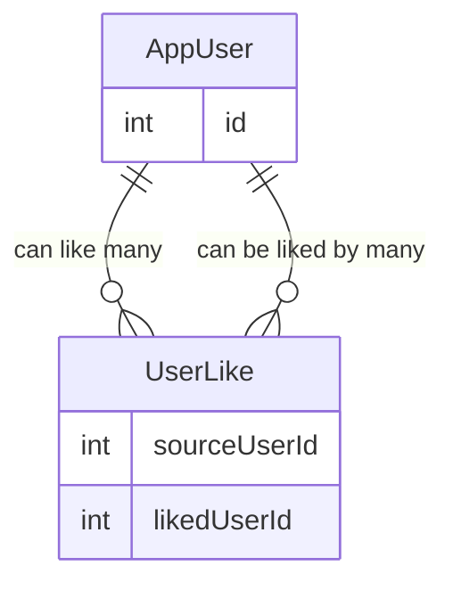

# DatingAppV2

## Table of Contents

1. [Overview](#overview)
2. [Endpoints](#endpoints)
3. [Database Schemas](#database-schemas)
4. [Feature Architecture](#feature-architecture)
5. [Key Advantages](#-key-advantages)

# Overview

Dating App V2


# Endpoints

## Likes Endpoint

Base Route: /api/likes

This controller manages member-to-member likes, supporting toggling likes, retrieving liked member IDs, and listing likes based on relationship direction.

---

### POST `/api/likes/{targetMemberId}`

Toggle a like between the current authenticated member and a target member.

### Behavior

- If the current member has not liked the target → a like is created
- If the like already exists → the like is removed
- Members cannot like themselves

### Route Parameters

| Name           | Type   | Description                        |
|----------------|--------|------------------------------------|
| targetMemberId | string | ID of the member to like or unlike |

### Responses

| Status         | Description                               |
|----------------|-------------------------------------------|
| 200 OK         | Like added or removed successfully        |
| 400 Bad Request | Attempt to like self or persistence failure |

---

### GET `/api/likes/list`

Returns a list of member IDs that the current member has liked.

### Response Example

```json
[
  "memberId1",
  "memberId2",
  "memberId3"
]
```

### GET `/api/likes?predicate={predicate}`

Returns a list of `Member` objects based on the type of like relationship relative to the **current authenticated user**.

---

### Query Parameters

| Name | Type | Required | Description |
|------|------|----------|------------|
| predicate | string | Yes | Determines which like relationship to return |

---

### Predicate Values & Behavior

#### `liked`

Returns members that the **current user has liked**.

**Logic**

- `SourceMemberId == currentUserId`
- Returns `TargetMember`

---

#### `likedBy`

Returns members who have **liked the current user**.

**Logic**

- `TargetMemberId == currentUserId`
- Returns `SourceMember`

---

#### `mutual` (default)

Returns members who:

- The current user has liked **AND**
- Have also liked the current user

**Logic**

1. Fetch IDs of members the current user has liked
2. Find likes where:
   - `TargetMemberId == currentUserId`
   - `SourceMemberId` exists in the liked IDs list
3. Return `SourceMember`

---

### Response Example

```json
[
  {
    "id": "memberId",
    "displayName": "Jane Doe",
    "photoUrl": "...",
    "age": 29
  }
]
```

# Database Schemas

## Relational Model for Like Feature

- **AppUser** has a **many-to-many relationship with itself** (AppUser ↔ AppUser)  
- This relationship is implemented through the **UserLike** join table.
- Self referencing many to many relationship

### UserLike

- **SourceUserId** (FK → AppUser) — the user who initiates the like
- **LikedUserId** (FK → AppUser)— the user who is being liked

Each record in `UserLike` represents one user liking another user.



# Feature Architecture

## Photo Upload

### Core Components

| Component         | Responsibility                             |
| ----------------- | ------------------------------------------ |
| Angular App       | Upload images & display them               |
| .NET API          | Generate pre-signed URLs, validate uploads |
| Amazon S3         | Secure image storage                       |
| Amazon CloudFront | Public image delivery layer                |
| IAM               | Enforces least-privilege access            |

# 📸 Photo Upload & Display Architecture

**Angular + .NET + AWS (S3 + CloudFront)**

This document describes the production-ready architecture used to securely upload photos to AWS S3 using **pre-signed URLs generated by a .NET backend**, and to display those images in an **Angular application via CloudFront**.

---

## 🧭 Overview

This architecture is designed to:

- Avoid sending large files through backend servers
- Keep S3 buckets fully private
- Secure uploads using time-limited pre-signed URLs
- Serve images globally using CloudFront
- Scale automatically with minimal operational overhead

---

## 🧱 System Components

### Angular Application

- Allows users to select images
- Uploads images directly to S3 using pre-signed URLs
- Displays images using CloudFront URLs

### .NET Backend API

- Validates upload requests
- Generates S3 pre-signed URLs
- Controls upload permissions and object paths

### Amazon S3

- Stores uploaded images
- Remains completely private
- Acts as CloudFront’s origin

### Amazon CloudFront

- Public CDN layer for image delivery
- Caches images at edge locations
- Accesses S3 using Origin Access Control (OAC)

### AWS IAM

- Enforces least-privilege access
- Restricts write access to uploads only
- Restricts read access to CloudFront only

---

## ⬆️ Upload Architecture

### Step 1: User Selects an Image (Angular)

- User selects an image file (`jpg`, `png`, `webp`)
- The file is **not** sent to the backend
- Angular sends only metadata to the .NET API

```json
{
  "fileName": "avatar.jpg",
  "contentType": "image/jpeg"
}
```

### Step 2: Generate a Pre-Signed S3 Upload URL (.NET API)

The Angular application requests a pre-signed upload URL from the .NET backend. This allows the client to upload images directly to Amazon S3 without sending file data through the API.

#### Request (Angular → .NET API)

- The client sends only file metadata to the backend.

```json
{
  "fileName": "avatar.jpg",
  "contentType": "image/jpeg"
}
```

#### Backend Responsibilities (.NET API)

- Validate file type and file size
- Construct a deterministic S3 object key

```bash
users/{userId}/avatar.jpg
```

- Generate a PUT pre-signed S3 URL with a short expiration time
- Return the upload URL and object key to the client

```json
Response (.NET → Angular)
{
  "uploadUrl": "https://s3.amazonaws.com/...",
  "objectKey": "users/123/avatar.jpg"
}
```

#### Why This Approach Is Used

- The backend never handles file bytes
- Upload access is time-limited and scoped
- Prevents unauthorized uploads
- Scales without backend performance impact

### Step 3: Upload Image Directly to S3 (Angular)

Using the pre-signed URL, the Angular application uploads the image directly to Amazon S3.

#### Upload Flow

-Angular performs an HTTP PUT request to the pre-signed URL
-The image file is sent as the request body
-Amazon S3 validates the signature, expiration, and permissions
-The image is stored in a private S3 bucket

#### Key Advantages

- No backend bottleneck
- Large files do not impact API performance
- Highly scalable and cost-efficient
- Secure, time-bound uploads

### Step 4: Display Image via CloudFront (Angular)

After the image upload completes, the image is displayed in the Angular application using a CloudFront URL.

#### Image Delivery Flow

- Angular references the image using the CloudFront distribution domain
- CloudFront retrieves the image from the S3 origin
- The image is cached at CloudFront edge locations
- Subsequent requests are served from the cache

Example Usage

```html

```

#### CloudFront Configuration

- Amazon S3 is configured as the origin
- Origin Access Control (OAC) is enabled
- The S3 bucket is not publicly accessible
- Only CloudFront can read objects from S3

#### Benefits

- Low-latency global image delivery
- Reduced load on S3
- Secure access to private buckets
- CDN-accelerated image rendering

## Security Model

### Upload Security

- Time-limited pre-signed URLs
- Restricted to a single object key
- MIME type validation
- File size limits

### Read Security

- Private S3 bucket
- CloudFront Origin Access Control
- (Optional) Signed CloudFront URLs for private images

## 🏗️ Message Architecture Flow

1. **Angular (WebSocket)**
    - Initiates the persistent connection.
2. **AWS API Gateway (WebSocket)**
    - Manages the stateful connection between the client and the cloud.
3. **AWS Lambda**
    - Triggers on message events to process logic.
4. **.NET API (REST) → SQL DB**
    - Lambda pushes data to your existing backend for persistence.
5. **AWS API Gateway → Recipient**
    - The gateway pushes the message out to the target user.

---

## 🚀 Why this is the right choice

- **No servers to manage:** Total serverless overhead for the real-time layer.
- **Scales automatically:** Handles spikes in chat activity without manual intervention.
- **Cost-Effective:** Extremely cheap for low to medium traffic since you only pay per message/connection minute.
- **Seamless Integration:** Works perfectly with your current **.NET API**.
- **Future-Proof:** Easy to add "user presence" (online/offline status) later.

---

## 🧩 Components Overview

### 1️⃣ WebSocket Layer (AWS)

**AWS API Gateway (WebSocket)**

- **Handles:** User connections, message fan-out, and presence tracking (later).
- **Role:** Acts as the "switchboard" for all live traffic.

### 2️⃣ Business Logic (AWS Lambda)

- **Stateless:** Spin up only when a message is sent.

- **Router:** Determines where a message needs to go.
- **Bridge:** Calls your existing API to ensure data consistency.

### 3️⃣ Persistence (Existing .NET API)

- **Authoritative:** Your SQL database remains the "Source of Truth."

- **RESTful:** Messages are still saved via standard REST calls from the Lambda function.

### 4️⃣ Frontend (Angular)

- **Hybrid Approach:** Keeps using REST for fetching chat history.

- **Real-time:** Switches to WebSockets exclusively for live updates and instant messaging.

## 🛠️ AWS Implementation Components

| Component | Summary & Core Purpose | How You Will Use It |
| :--- | :--- | :--- |
| **AWS API Gateway** | The **"Front Door"** for all client traffic. It manages security, throttling, and persistent connections. | Acts as the **WebSocket server** for Angular. It maintains the persistent connection, routes incoming messages to Lambda, and pushes outgoing messages back to specific recipients. |
| **AWS Lambda** | **Serverless Compute** that runs code only when needed. No servers to maintain. | Acts as the **Glue**. When a message hits the Gateway, Lambda triggers to process the logic, authenticate the user, and "talk" to your .NET API. |
| **.NET API (Existing)** | Your core **Business Logic** and data management layer. | Receives data from Lambda via REST. It handles the "heavy lifting" like saving messages to the database and validating business rules. |
| **SQL Database** | The **Source of Truth** for all persistent data. | Stores chat history, user profiles, and metadata. It ensures that if a user refreshes their app, their history is still there. |
| **CloudWatch** | **Monitoring and Logging** service for AWS resources. | You will use this to debug your Lambda functions and track WebSocket connection errors in real-time. |
