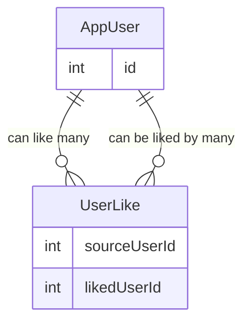

# DatingAppV2

Version 2 of Dating App

# Endpoints

## Likes Endpoint

Base Route: /api/likes

This controller manages member-to-member likes, supporting toggling likes, retrieving liked member IDs, and listing likes based on relationship direction.

---

### POST `/api/likes/{targetMemberId}`

Toggle a like between the current authenticated member and a target member.

### Behavior

- If the current member has not liked the target → a like is created
- If the like already exists → the like is removed
- Members cannot like themselves

### Route Parameters

| Name | Type | Description |
|------|------|------------|
| targetMemberId | string | ID of the member to like or unlike |

### Responses

| Status | Description |
|--------|------------|
| 200 OK | Like added or removed successfully |
| 400 Bad Request | Attempt to like self or persistence failure |

---

### GET `/api/likes/list`

Returns a list of member IDs that the current member has liked.

### Response Example

```json
[
  "memberId1",
  "memberId2",
  "memberId3"
]
```

### GET `/api/likes?predicate={predicate}`

Returns a list of `Member` objects based on the type of like relationship relative to the **current authenticated user**.

---

### Query Parameters

| Name | Type | Required | Description |
|------|------|----------|------------|
| predicate | string | Yes | Determines which like relationship to return |

---

### Predicate Values & Behavior

#### `liked`

Returns members that the **current user has liked**.

**Logic**

- `SourceMemberId == currentUserId`
- Returns `TargetMember`

---

#### `likedBy`

Returns members who have **liked the current user**.

**Logic**

- `TargetMemberId == currentUserId`
- Returns `SourceMember`

---

#### `mutual` (default)

Returns members who:

- The current user has liked **AND**
- Have also liked the current user

**Logic**

1. Fetch IDs of members the current user has liked
2. Find likes where:
   - `TargetMemberId == currentUserId`
   - `SourceMemberId` exists in the liked IDs list
3. Return `SourceMember`

---

### Response Example

```json
[
  {
    "id": "memberId",
    "displayName": "Jane Doe",
    "photoUrl": "...",
    "age": 29
  }
]
```

# Database Schemas

## Relational Model for Like Feature

- **AppUser** has a **many-to-many relationship with itself** (AppUser ↔ AppUser)  
- This relationship is implemented through the **UserLike** join table.
- Self referencing many to many relationship

### UserLike

- **SourceUserId** (FK → AppUser) — the user who initiates the like
- **LikedUserId** (FK → AppUser)— the user who is being liked

Each record in `UserLike` represents one user liking another user.



# AWS Architecture (Practical & Scalable)

We’ll use a hybrid, cloud-native pattern to balance real-time performance with your existing infrastructure.

---

## 🏗️ Architecture Flow

1. **Angular (WebSocket)**
    - Initiates the persistent connection.
2. **AWS API Gateway (WebSocket)**
    - Manages the stateful connection between the client and the cloud.
3. **AWS Lambda**
    - Triggers on message events to process logic.
4. **.NET API (REST) → SQL DB**
    - Lambda pushes data to your existing backend for persistence.
5. **AWS API Gateway → Recipient**
    - The gateway pushes the message out to the target user.

---

## 🚀 Why this is the right choice

- **No servers to manage:** Total serverless overhead for the real-time layer.
- **Scales automatically:** Handles spikes in chat activity without manual intervention.
- **Cost-Effective:** Extremely cheap for low to medium traffic since you only pay per message/connection minute.
- **Seamless Integration:** Works perfectly with your current **.NET API**.
- **Future-Proof:** Easy to add "user presence" (online/offline status) later.

---

## 🧩 Components Overview

### 1️⃣ WebSocket Layer (AWS)

**AWS API Gateway (WebSocket)**

- **Handles:** User connections, message fan-out, and presence tracking (later).
- **Role:** Acts as the "switchboard" for all live traffic.

### 2️⃣ Business Logic (AWS Lambda)

- **Stateless:** Spin up only when a message is sent.

- **Router:** Determines where a message needs to go.
- **Bridge:** Calls your existing API to ensure data consistency.

### 3️⃣ Persistence (Existing .NET API)

- **Authoritative:** Your SQL database remains the "Source of Truth."

- **RESTful:** Messages are still saved via standard REST calls from the Lambda function.

### 4️⃣ Frontend (Angular)

- **Hybrid Approach:** Keeps using REST for fetching chat history.

- **Real-time:** Switches to WebSockets exclusively for live updates and instant messaging.

## 🛠️ AWS Implementation Components

| Component | Summary & Core Purpose | How You Will Use It |
| :--- | :--- | :--- |
| **AWS API Gateway** | The **"Front Door"** for all client traffic. It manages security, throttling, and persistent connections. | Acts as the **WebSocket server** for Angular. It maintains the persistent connection, routes incoming messages to Lambda, and pushes outgoing messages back to specific recipients. |
| **AWS Lambda** | **Serverless Compute** that runs code only when needed. No servers to maintain. | Acts as the **Glue**. When a message hits the Gateway, Lambda triggers to process the logic, authenticate the user, and "talk" to your .NET API. |
| **.NET API (Existing)** | Your core **Business Logic** and data management layer. | Receives data from Lambda via REST. It handles the "heavy lifting" like saving messages to the database and validating business rules. |
| **SQL Database** | The **Source of Truth** for all persistent data. | Stores chat history, user profiles, and metadata. It ensures that if a user refreshes their app, their history is still there. |
| **CloudWatch** | **Monitoring and Logging** service for AWS resources. | You will use this to debug your Lambda functions and track WebSocket connection errors in real-time. |
